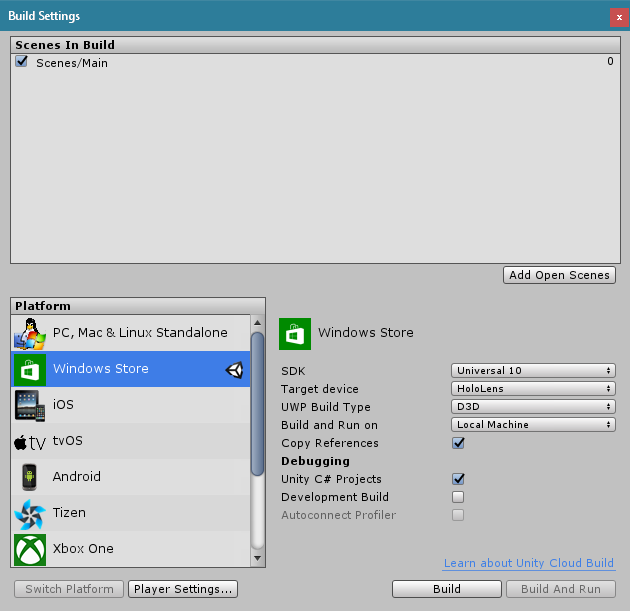

# HoloViveObserver
Observe a VR session from the same room using a HoloLens!

# Building
Open the HoloViveObserver directory using *Unity 5.5.0f3 (64-bit)*.

## Building the Vive (SteamVR) app
First, open the File -> Build Settings menu.

Make sure *PC, Mac & Linux Standalone* is selected. If it isn't, select it and
click *Switch Platform*. Then make sure the Main and Vive scenes are checked,
but the HoloLens scene is unchecked. See the below image. Then close the Build
Settings window and hit the play button in Unity.

You don't need to open the Build Settings menu for subsequent VR runs unless
you change those settings to run on HoloLens.

## Building the HoloLens app
Open the File -> Build Settings menu.

Make sure *Windows Store* is selected. If it isn't, select it and click
*Switch Platform*. Then make sure the Main and HoloLens scenes are checked,
but the Vive scene is unchecked.

Then click *Build* and select the existing *App* folder. This will export
a Visual Studio project. Yes, you have to do this each time you make changes
within Unity and want to deploy to HoloLens. If you *just* make code changes,
you can skip the Build Settings step and build right from Visual Studio.

Within the *App* folder, open the *Vive Observer.sln* file. Do not be confused
by the HoloViveObserver.sln file in the parent folder, that solution has no
projects.

Once within Visual Studio, select *Release* and target *x86*, then choose
whether you want to deploy to an actual HoloLens or the emulator.

